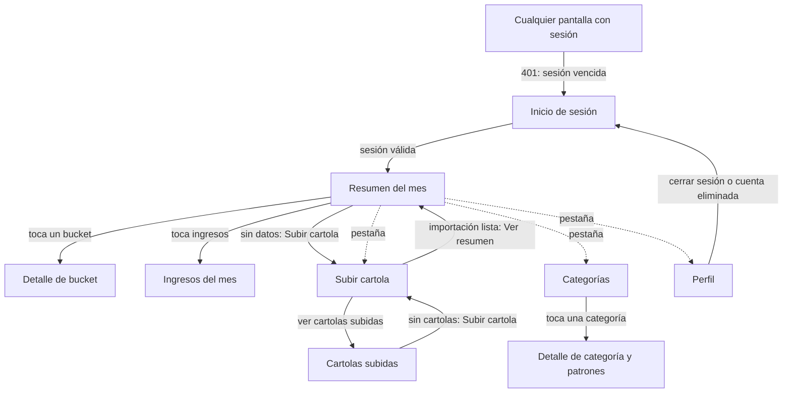

# Catálogo de pantallas

Referencia única de las pantallas de las apps nativas de Mirach. La app de iPhone (Swift/SwiftUI) la implementa primero y la de Android (Kotlin/Compose) después: ambas siguen este catálogo, de modo que no diverjan como lo hicieron la web y la app Expo del repositorio anterior.

**Cómo se usa.** Un cambio en una pantalla, o una pantalla nueva, empieza editando su archivo en `pantallas/` (o copiando [`_plantilla.md`](pantallas/_plantilla.md)) y después se implementa en cada app. El catálogo es una especificación de comportamiento, no un diseño visual: no define maquetación ni colores (los tokens llegan en la tarea T2 de [`odd/tasks/contrato-referencia.md`](../../odd/tasks/contrato-referencia.md)).

**Fuentes de verdad.**

- Contrato HTTP: [`apps/api/openapi.json`](../../apps/api/openapi.json). Cada endpoint nombrado aquí existe en ese archivo. Lo que la pantalla necesita y el contrato no ofrece se lista en [Brechas del API](#brechas-del-api); no se inventa.
- Decisiones: [`docs/adr/`](../adr/README.md). Clientes delgados: toda regla de negocio o cálculo vive en el API (ADR-046, D9).
- Producto previo (solo referencia): las pantallas del repositorio MoneyDiary, citadas al final de cada archivo.

## Convenciones

- Cada pantalla tiene las mismas secciones: Propósito, Datos que muestra, Acciones, Endpoints, Estados, Navegación, Notas para iPhone y Referencia.
- Los endpoints se escriben `MÉTODO /ruta` tal como aparecen en `openapi.json`. Los códigos de error con nombre (`PDF_PROTEGIDO`, `NOMBRE_DUPLICADO`...) se leen del campo `code` del cuerpo de error.
- Los nombres de campo (`porcentajeBp`, `categoriaId`...) son los del esquema de respuesta. Los nombres de pantalla y de sección son los del catálogo, no son clases ni rutas de código.
- «Después» y «Fuera» se decidieron el 2026-10-04 (ver [`contrato-referencia.md`](../../odd/tasks/contrato-referencia.md)).

## Mapa de navegación (v1)

La barra de pestañas (Resumen, Subir, Categorías, Perfil) es una propuesta de este catálogo; las apps anteriores usaban barra lateral (web) y cabecera (Expo).

## Pantallas de la v1

| Pantalla | Archivo |
|---|---|
| Inicio de sesión (Apple y Google) | [`pantallas/inicio-de-sesion.md`](pantallas/inicio-de-sesion.md) |
| Resumen del mes (semáforo, gráfico, ingresos, resumen anual) | [`pantallas/resumen-del-mes.md`](pantallas/resumen-del-mes.md) |
| Detalle de bucket (reclasificar, crear categoría) | [`pantallas/detalle-de-bucket.md`](pantallas/detalle-de-bucket.md) |
| Ingresos del mes | [`pantallas/ingresos-del-mes.md`](pantallas/ingresos-del-mes.md) |
| Subir cartola (vista previa, revisión por fila, confirmar, PDF protegido) | [`pantallas/subir-cartola.md`](pantallas/subir-cartola.md) |
| Cartolas subidas (lista y eliminar una) | [`pantallas/cartolas-subidas.md`](pantallas/cartolas-subidas.md) |
| Categorías (lista y crear) | [`pantallas/categorias.md`](pantallas/categorias.md) |
| Detalle de categoría y patrones | [`pantallas/detalle-de-categoria.md`](pantallas/detalle-de-categoria.md) |
| Perfil (nombre, cerrar sesión, eliminar cuenta) | [`pantallas/perfil.md`](pantallas/perfil.md) |

Plantilla para pantallas nuevas: [`pantallas/_plantilla.md`](pantallas/_plantilla.md).

## Después

Quedan fuera de la v1 por decisión de alcance, pero previstas:

| Función | Nota |
|---|---|
| Detalle del semáforo por bucket (`GET /api/resumen/semaforo`: bandas, diagnóstico, consejo en CLP) | El resumen de la v1 solo muestra el estado global y el estado por bucket de `GET /api/resumen`. Antes de construirlo hay que resolver la brecha 5 (texto del API con «Gustos»). |
| Eliminar un movimiento suelto | El API solo permite borrar movimientos manuales (`DELETE /api/movimientos/{id}`); sin entrada manual en la v1 no hay nada que borrar. |
| Reevaluar patrones sobre los movimientos existentes (`POST /api/transacciones/reevaluar`) | Se usaba desde el detalle de bucket. |
| Ayuda y glosario | Sin dependencia del API. |
| Selector de tema claro/oscuro | La v1 sigue el tema del sistema. |

## Fuera

No forman parte del producto nativo:

| Función | Motivo |
|---|---|
| Correo y contraseña para iniciar sesión, y cambio de contraseña (`POST /api/auth/login`, `PATCH /api/perfil/password`) | El inicio de sesión es solo Apple y Google (ADR-047). Los endpoints siguen en el contrato por compatibilidad, pero ninguna pantalla los usa. |
| Cambio de correo (campos `email` y `passwordActual` de `PATCH /api/perfil`) | Depende de la contraseña; el perfil edita solo `nombre`. |
| Vincular y desvincular Google desde el perfil (`POST /api/perfil/google/vincular`, `POST /api/perfil/google/desvincular`) | Decisión de alcance; además exigen `passwordActual`. |
| Ingreso manual de movimientos (`POST /api/movimientos`) | Decisión de alcance. |
| Ofrecer un patrón después de reclasificar | Decisión de alcance. |
| Modo demo | Se eliminó del producto (ADR-046, D5). |
| Flujo web de Google (`GET /api/auth/google` y su callback) y sesión por cookie | Piezas web dormidas; los clientes nativos usan token (`POST /api/auth/google/token`). |
| Subida de un solo paso (`POST /api/ingestas`) | Marcada como obsoleta en el contrato; se usa `POST /api/ingestas/preview` y `POST /api/ingestas/commit`. |
| Listado plano de movimientos (`GET /api/movimientos`) y detalle plano de bucket (`GET /api/buckets/{bucket}`) | Las pantallas de la v1 usan `GET /api/buckets/{bucket}/detalle` (agrupado por categoría) y `GET /api/ingresos/mes`. |
| Arrastrar y soltar, borrador de revisión en el navegador, selección masiva de cartolas, deshacer de eliminación | Particularidades de la web; ver las notas de cada pantalla. |

## Reglas globales

**Autenticación y encabezados.**

- Toda llamada a `/api` lleva el encabezado `x-api-key` (compuerta pública del cliente).
- Toda llamada, salvo `GET /api/auth/capabilities`, `POST /api/auth/apple/token` y `POST /api/auth/google/token`, lleva además `Authorization: Bearer <token>`. El token y su `expiresAt` salen de `AuthLoginResponse` (`token`, `userId`, `expiresAt`).
- El token se guarda en el Keychain y se descarta al cerrar sesión, al recibir 401 y al eliminar la cuenta.
- Al iniciar la app con un token guardado se valida con `GET /api/auth/me`: 200 entra al Resumen, 401 vuelve al inicio de sesión.

**Sesión vencida.** Un 401 en cualquier llamada autenticada descarta la sesión y lleva al inicio de sesión, sin reintento automático. Toda pantalla recuerda ese comportamiento solo en sus estados de error, no lo repite.

**Errores.** Los cuerpos de error son `{ message, code? }`. Orden de preferencia para el texto mostrado: copia propia de la app para el `code` conocido; si no, el `message` del servidor cuando la pantalla lo indica; si no, un texto genérico. Un fallo de red (sin respuesta) se muestra como «Problema de conexión» con reintento. Los 5xx se tratan como transitorios y ofrecen reintento; los 4xx de validación no se reintentan sin que el usuario cambie algo.

**Patrones de estado.** Todas las pantallas que cargan datos tienen los mismos cuatro estados:

- *Cargando*: indicador de progreso con texto; no se muestran datos viejos de otro mes o de otra cuenta.
- *Vacío*: mensaje que explica por qué y, cuando existe, la acción que lo resuelve (normalmente «Subir cartola»).
- *Error con reintento*: mensaje y botón «Reintentar» que repite la misma consulta.
- *Éxito*: los datos. Las acciones de escritura anuncian su resultado en una línea de estado accesible (VoiceOver).

Tirar para refrescar (pull to refresh) repite la consulta de lectura de la pantalla.

**Dinero.** Todos los montos del API son cadenas decimales enteras en pesos chilenos (`"1234567"`, sin decimales, a veces con signo `-`). Se parsean como enteros exactos (nunca como `Float` ni `Double`) y se muestran como `$1.234.567` (punto como separador de miles, `-$1.234` para negativos). El signo `+`/`-` solo se antepone donde la pantalla lo indica. Las cifras y fechas se muestran con dígitos tabulares.

**Porcentajes.** `porcentajeBp` y `metaBp` están en puntos base: se muestran como `porcentajeBp / 100` seguido de `%` (por ejemplo `3050` es `30.5%`, con la coma decimal local). Si es `null` (mes sin ingreso) se muestra «—». La app solo da formato; no calcula porcentajes propios.

**Fechas y períodos.** `fecha` llega como marca ISO-8601 UTC. Se muestra la fecha de calendario de sus primeros diez caracteres (`AAAA-MM-DD`) sin convertir a la zona horaria del dispositivo, para que un movimiento no cambie de día. Un período es `AAAA-MM`. Los nombres de mes se muestran en español. Cuando se omite `periodo` el API resuelve el último mes con movimientos (o el mes actual si no hay ninguno) y lo devuelve en el campo `periodo`: la pantalla muestra siempre el valor devuelto, no el solicitado.

**Terminología.** El bucket del 30 % se muestra como **«Deseos»** (valor `Deseos` del API). Nunca «Gustos». Los otros dos son «Necesidades» y «Ahorro».

**Color nunca solo.** Cada bucket y cada estado de semáforo (`verde`, `amarillo`, `rojo`) se muestra con su color y siempre con una etiqueta de texto o un ícono (`DESIGN.md`: «El color nunca va solo»). El color del bucket es un relleno, nunca el color del texto.

**Confirmación de acciones destructivas.** Eliminar una cartola, una categoría, un patrón o la cuenta pide confirmación explícita con la consecuencia descrita. Descartar una revisión de cartola también.

**Accesibilidad.** Objetivos táctiles de al menos 44 pt; cada control con nombre accesible; los cambios de estado relevantes se anuncian.

## Brechas del API

Lo que las pantallas necesitan y el contrato (`openapi.json` en `main`) o el servidor aún no ofrecen. Ninguna se resuelve con lógica en el cliente.

| # | Brecha | Pantalla que la necesita | Efecto en la v1 |
|---|---|---|---|
| 1 | **Códigos de error de la subida no documentados en `openapi.json`.** `POST /api/ingestas/preview` y `POST /api/ingestas/commit` devuelven 400 sin esquema; el servidor responde `{message, code}` con `PDF_PROTEGIDO`, `PDF_PASSWORD_INCORRECTA` y `SIN_MOVIMIENTOS` (400), `CATALOGO_INCOMPLETO` (409, ausente del contrato) y `CATALOGO_NO_DISPONIBLE` (503), según `ingesta.routes.ts`. | [Subir cartola](pantallas/subir-cartola.md) | Los clientes generados no tipan esos códigos; la app los lee a mano del campo `code`. Hay que documentarlos en el contrato (afecta a T3). |
| 2 | **`403 CATEGORIA_INTERNA` no documentado.** `PATCH /api/categorias/{id}` y `DELETE /api/categorias/{id}` lo devuelven al tocar una categoría interna (`Desconocido`), pero el contrato solo lista 400, 404 y 409. | [Detalle de categoría](pantallas/detalle-de-categoria.md) | Igual que la brecha 1. |
| 3 | **`CategoriaResponse` no indica cuáles categorías son internas.** El servidor tiene `esInterna`, pero no sale en el contrato. | [Categorías](pantallas/categorias.md), [Detalle de categoría](pantallas/detalle-de-categoria.md), [Detalle de bucket](pantallas/detalle-de-bucket.md) | La app no puede ocultar «editar/eliminar» en las tres `Desconocido`; solo se entera por el 403 al intentar. Se propone agregar `esInterna` al esquema. |
| 4 | **Porcentaje de reparto del gasto entre buckets.** La web calculaba en el cliente la participación de cada bucket dentro del gasto total (con redondeo que suma 100). Ni `GET /api/resumen` ni `GET /api/resumen/anual` la entregan; solo `porcentajeBp`, que es respecto del ingreso. | [Resumen del mes](pantallas/resumen-del-mes.md) | La v1 dibuja el gráfico con las proporciones de `total` y rotula con `total` y `porcentajeBp` (ambos del API). No muestra un «% del gasto» propio hasta que el API lo entregue. |
| 5 | **Texto generado por el servidor con «Gustos».** `diagnostico` y `consejo.mensaje` de `GET /api/resumen/semaforo` y el mensaje de `CATALOGO_INCOMPLETO` usan la etiqueta «Gustos» (`ETIQUETA_BUCKET_COPY` en `semaforo-detalle.ts` y `catalogo-incompleto.error.ts`). | [Subir cartola](pantallas/subir-cartola.md) (409) y, después, el detalle del semáforo | En la v1 la app muestra copia propia para `CATALOGO_INCOMPLETO` en lugar del `message`. Corregir el texto del API antes de construir el detalle del semáforo. |
| 6 | **Revocación de Sign in with Apple al eliminar la cuenta.** `DELETE /api/cuenta` invoca un revocador de identidad externa que hoy es un `NoopRevocadorIdentidadExterna` («T4 la reemplaza por la revocación real»). Apple exige revocar los tokens del usuario al borrar la cuenta. | [Perfil](pantallas/perfil.md) | La pantalla funciona, pero la función no debería publicarse en la App Store hasta que la revocación sea real. |
| 7 | **Mensajes de error del servidor con voseo o jerga.** Por ejemplo `CONFIRMACION_INVALIDA` dice «escribí ELIMINAR»; `BUCKET_NO_ASIGNABLE` dice «El bucket debe ser uno de: Necesidades, Deseos, Ahorro». | Perfil, Categorías | La app usa copia propia para los `code` conocidos y no muestra el `message` en esos casos. |
| 8 | **Los 401 no distinguen causa.** Una `x-api-key` inválida y una sesión vencida devuelven 401 con cuerpo `{message}` sin `code`. | Todas | La app trata todo 401 autenticado como sesión vencida. Una clave de cliente incorrecta se vería como un bucle de inicio de sesión. |
| 9 | **Orden de las listas sin documentar.** `GET /api/ingestas` entrega primero la más reciente y `GET /api/categorias` ordena por nombre, pero el contrato no lo dice. | [Cartolas subidas](pantallas/cartolas-subidas.md), [Categorías](pantallas/categorias.md) | La app conserva el orden recibido para las cartolas y agrupa el catálogo por bucket. |
| 10 | **Sin endpoint para consultar qué meses tienen datos.** | [Resumen del mes](pantallas/resumen-del-mes.md) | El selector de mes se apoya en `GET /api/resumen/anual` (`meses[].sinIngreso`). |

**Protección con contraseña en PDF.** No es una brecha: el API la soporta. Detalle en [Subir cartola](pantallas/subir-cartola.md#pdf-protegido).
